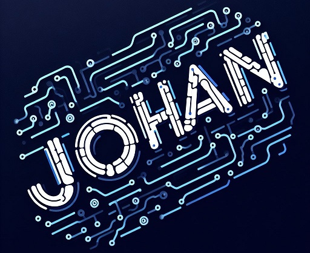
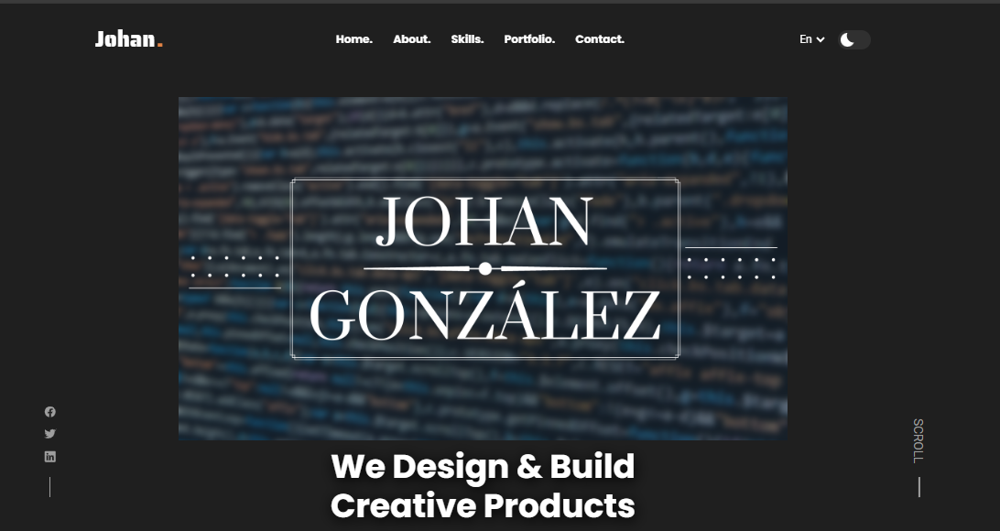

<div align="center">
  
  
  
  
[](https://twitter.com/intent/follow?screen_name=nentiendo)


  <br />
  <br />
  
  

  <h2 align="center">Johan - Personal Portfolio</h2>

  This website is fully responsive personal portfolio, <br />Responsive for all devices, built using HTML, CSS, and JavaScript.

</div>

<br />

### Screenshot



### Prerequisites

Before you begin, ensure you have met the following requirements:

* [Git](https://git-scm.com/downloads "Download Git") must be installed on your operating system.

### Run Locally

To run **Johanfer12.github.io** locally, run this command on your git bash:

Linux and macOS:

```bash
sudo git clone https://github.com/Johanfer12/Johanfer12.github.io.git
```

Windows:

```bash
git clone https://github.com/Johanfer12/Johanfer12.github.io.git
```

### Contact

If you want to contact with me you can reach me at [Twitter](https://www.twitter.com/nentiendo).

### License

This project is **free to use** and does not contains any license.

### Credits

Based in the **codewithshadee** portfolio theme: [Github](https://github.com/codewithsadee/jack-portfolio)
